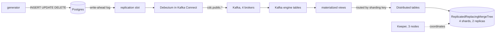

# 03-dbms — the source database, change capture, and the warehouse

PostgreSQL as the operational source, Debezium streaming every insert, update
and delete into Kafka, and a ClickHouse cluster of four shards with two
replicas each consuming those changes into a staging layer that deduplicates
them.

Step 3 of [bigdata-cluster-docker](../README.md). It **includes**
`02-monitoring`, which includes `01-kafka`, so `make up` here starts the whole
platform — twenty-three containers.

## Quick start

```bash
cp .env.example .env
cp ../02-monitoring/.env.example ../02-monitoring/.env   # if not already there
cp ../01-kafka/.env.example ../01-kafka/.env             # if not already there
chmod +x scripts/smoke.sh connect/register-connector.sh

make up
make connector
sleep 60
make test
```

The minute matters. ClickHouse's Kafka consumers take up to that long to join
their groups and receive partitions, and the smoke test asserts that messages
have actually been read.

| | |
|---|---|
| Postgres | localhost:5432, database `shop`, user `app` |
| ClickHouse | http://localhost:8123/play, database `analytics` |
| Kafka Connect API | http://localhost:8083 |
| Kafbat UI | http://localhost:8080 |
| Grafana | http://localhost:3000 |
| Prometheus | http://localhost:9090 |

Nodes 2 through 8 of ClickHouse are on ports 8124 to 8130, one each, so every
replica can be asked separately what it holds.

## How the data moves



No polling and no triggers anywhere in that chain. Postgres already writes
every change to its write-ahead log for its own durability; Debezium opens a
logical replication slot, which is a bookmark into that log, and reads from it.
The database does no extra work.

There is also no consumer service between Kafka and ClickHouse. The Kafka
engine is a table that is also a consumer, and a materialized view is an insert
trigger on it. Reading from such a table consumes messages, which is why
nothing ever selects from one directly.

## What is inside

| Container | Role |
|---|---|
| `postgres` | the operational source, `wal_level=logical` |
| `generator` | keeps the source changing, so there is something to capture |
| `postgres-exporter` | database metrics, discovered by label |
| `kafka-connect` | the Debezium runtime, driven through a REST API |
| `jmx-connect` | Connect and Debezium metrics over JMX |
| `keeper-1..3` | Raft quorum coordinating replication |
| `clickhouse-01..08` | four shards, two replicas each |

## Design decisions

Each of these was forced by something, and the something is usually a failure
that leaves everything looking healthy.

### REPLICA IDENTITY FULL, set five steps before it was needed

Postgres logs only the primary key for updates and deletes by default. That is
enough for its own replication and useless for capture: a delete event would
arrive as an id with every other column null, and the warehouse would know that
a row was removed but not which one.

`FULL` logs the whole old row. It costs write-ahead log volume, which matters
on a busy production table and not at all here.

It has to be set before the events are written — turning it on later does not
retroactively fix what is already in the log. Forgetting it produces deletes
that look empty rather than broken, which is a particularly unpleasant thing to
diagnose.

### The version column is the log position, not a timestamp

`ReplacingMergeTree` keeps the row with the highest version for each sort key.
The obvious choice is `updated_at`, and it is the wrong one: that column is set
by application code, which can forget to touch it, set it in the wrong time
zone, or write two updates inside the same millisecond.

`source_lsn` is the write-ahead log position, monotonic per database, produced
by Postgres itself. It cannot be wrong about ordering, because ordering is what
it is.

This is also what makes replaying a topic safe. The same events produce the
same versions with the same keys, and deduplication collapses them back to one.
Idempotent by construction.

### The sharding key is the primary key of the source table

Deduplication happens **within a shard**. If two versions of one row land on
different shards, nothing ever collapses them, and the warehouse quietly holds
both an old and a new copy of the same record.

So every Distributed table shards on the source primary key. One exception, and
it is deliberate: `order_items` shards on `order_id` rather than its own
`order_item_id`, so the lines of an order live on the same node as the order
and joining them stays local instead of shipping rows across the network.

### Partitioning only by columns that never change

Deduplication also happens **within a partition**. Partitioning by `updated_at`
would move each new version into a different partition, where the old one would
survive forever — through any number of merges and any `OPTIMIZE FINAL`.

`orders` and `customers` partition by `created_at`. `order_items` has no
timestamp at all, so it uses a bucket of the id. `products` has only
`updated_at`, so it has no partitioning: `PARTITION BY tuple()`, which is
correct for a few hundred rows and would be wrong for anything large.

### The materialized views write to the Distributed table

Writing to the local table would save a network hop and be wrong. Every node
runs a consumer, and Kafka assigns partitions arbitrarily, so a row would land
on whichever node happened to read it rather than on the shard its key points
to — breaking the guarantee above.

### internal_replication = true

It tells a Distributed table to write each row to one replica of the target
shard and let replication copy it to the other. With `false` the Distributed
table writes to both itself, and replication then copies them again, producing
duplicates. With any `Replicated*` engine the correct value is always `true`.

### Keeper in separate containers, and three of them for eight nodes

Keeper can run embedded inside `clickhouse-server`. It does not here, for two
reasons. Mixing embedded and standalone Keepers is a known way to build a
cluster that half works. And Keeper is latency-sensitive: a heavy merge on a
co-located node delays its responses, and a slow Keeper stalls merges and
inserts across the *whole* cluster.

Three, not more, regardless of how many ClickHouse nodes there are. The quorum
size is about surviving the loss of a Keeper, not about how many servers it
serves — the same arithmetic as the KRaft controllers in `01-kafka`. Three
survives one. More would make every write to the quorum slower.

## Failure drills

### Losing a replica

```bash
make ch-drill-down      # stops clickhouse-02 and writes 2,000,000 rows
make ch-drill-up        # starts it and polls until the two agree
```

Three things to watch. The write succeeds while a replica is down, because the
Distributed table sends each row to the surviving replica of its shard. The
returning node is briefly behind. It converges on its own with no intervention.

The gap is short — ClickHouse replicates whole compressed parts rather than
rows, so two million narrow rows arrive in about a second. Use
`make ch-drill-down DRILL_ROWS=20000000` to make it visible.

### Losing change capture

```bash
docker stop kafka-connect
make cdc-status          # not registered / not reachable
make cdc-slot            # WAL retained by the slot starts growing
docker start kafka-connect
make cdc-status
```

This is the quiet one. Nothing errors. The topics stop receiving messages,
which is indistinguishable from an idle database, and the warehouse keeps
serving stale data while reporting no problem at all. Meanwhile Postgres
retains write-ahead log for the inactive slot and the disk fills.

That is what `PostgresInactiveReplicationSlot`, `ConnectTaskFailed` and
`ClickHouseKafkaIngestionStalled` in
`../02-monitoring/prometheus/rules/03-dbms.yml` exist for.

### Growing the cluster

Already done: this stack was built with two shards and grown to four. The
lesson is visible in `make ch-shards` — rows written before the growth stayed
on the original shards. **ClickHouse never rebalances an existing table when
shards are added.** There is no command that does it. In production this is
handled by planning enough shards up front, or by copying data out and back in.

## What continuous integration does not cover

The workflow for this stack starts everything **except** ClickHouse and Keeper,
and skips the eight checks that depend on them.

The reason is memory. Eight ClickHouse nodes at 2 GiB each is 16 GiB before
anything else runs, and a GitHub Actions runner has 16 GiB in total. There is
no configuration of the real cluster that fits.

The alternative would have been to test a smaller cluster — two nodes, one
shard — but that would exercise a topology this repository does not contain,
and the interesting failures are precisely the ones that only appear with more
than one shard.

So CI covers Postgres, the generator, Debezium, Kafka and their monitoring, and
says so. The skipped checks print as `SKIP` rather than disappearing, because a
summary reading "14 passed" should not look like full coverage.

**Everything below is verified locally, on a machine that can hold the
cluster.** The commands are exactly the ones CI would run if it could:

```bash
make up                 # all 23 containers, warehouse included
make connector
sleep 60
make test               # 22 checks, nothing skipped

make ch-macros          # shards 1,1,2,2,3,3,4,4 and eight distinct replicas
make ch-cluster         # 4 shards, 8 replicas, every node answering
make ch-keeper          # one leader, two followers
make ch-rows            # equal within a shard, different between shards
make ch-queues          # messages read, no consumer exceptions
make ch-compare         # row counts on both sides
make ch-e2e             # one row through every hop, insert to delete
make ch-drill-down && make ch-drill-up
```

Docker needs a generous memory allocation for this: 48 GiB was comfortable,
and 24 is about the floor. On less, `make up-light` runs the same stack without
the warehouse.

## Commands

```
make help            list every command
make up              start everything, seed, create schema and ingestion
make up-light        start everything except ClickHouse and Keeper
make connector       register the Debezium connector (idempotent)
make test            validate configs, then the running stack
make down            stop, keep the data
make clean           stop and wipe every volume in the project

make counts          row counts in Postgres
make cdc-status      connector, task and replication slot
make cdc-topics      the CDC topics and their message counts
make cdc-tail        watch change events arrive
make cdc-slot        how much WAL the slot is holding

make ch              interactive clickhouse-client
make ch-schema       create the staging tables (idempotent)
make ch-ingest       create the Kafka queues and views (idempotent)
make ch-ingest-reset rebuild them and replay the topics from the beginning
make ch-rows         rows per node
make ch-shards       rows per shard
make ch-queues       are the queues consuming, and are they erroring
make ch-consumers    Kafka's view of the ClickHouse consumer groups
make ch-compare      row counts on both sides
make ch-e2e          one row through the whole chain
make ch-dedup-test   versions collapse, deletes disappear
```

## Traps worth knowing

Every one of these cost time, and none of them announced itself.

**A Kafka consumer that starts at the end of a topic** subscribes, polls,
reports no error and reads nothing. Healthy consumers, recent poll,
`num_messages_read = 0`. Reading zero from a topic with a backlog looks exactly
like reading zero from an idle topic. ClickHouse sets `auto.offset.reset` to
earliest itself, so this does not happen here — but `messages_read = 0` right
after `make ch-ingest` is normal for up to a minute, and mistaking that for the
failure sends you a long way in the wrong direction.

**`ON CLUSTER` working does not mean distributed queries work.** They use
different transports: `ON CLUSTER` goes through a queue in Keeper and each node
executes locally, while a distributed query opens a real connection between
nodes. The image disables network access for the `default` user when no
credentials are given, which breaks the second while leaving the first intact.
See `clickhouse/server/users.d/99-default.xml`.

**A mount cannot be nested inside a read-only mount.** Mounting `config.d` as a
directory and then a file into it fails with `create mountpoint: read-only file
system`. Each file is mounted individually instead.

**`CLICKHOUSE_DB` only applies to an empty data directory.** A node that
started once and failed has already written to its volume, so the variable is
ignored forever after — and the symptom surfaces much later as "Database
analytics does not exist". `make ch-init` creates it explicitly with
`ON CLUSTER`.

**`clickhouse-client --query "INSERT ... VALUES (...)"` waits on stdin** after
the inline values, in case more rows follow. Under `docker compose exec -T` it
hangs forever with no output. `< /dev/null` fixes it; `INSERT ... SELECT` does
not have the problem.

**`psql -t -c "INSERT ... RETURNING id"` prints two lines**: the value and a
status line like `INSERT 0 1`. Piping both into the next query produces a
syntax error at a position that has nothing to do with anything you wrote.

**Kafka refuses to delete a consumer group that still has members**, and
members linger for the session timeout after their consumer is gone.
`make ch-ingest-reset` retries rather than failing once.
