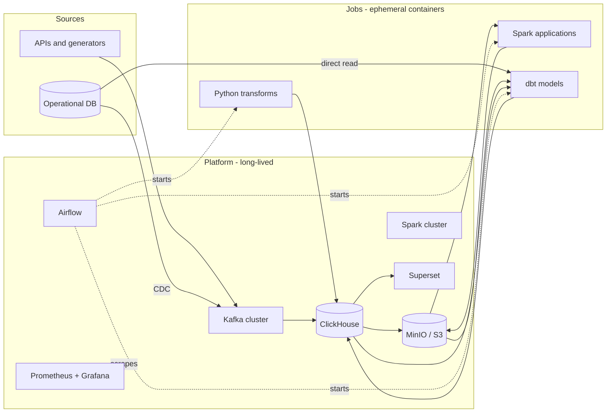

# bigdata-cluster-docker

[](https://github.com/cyril-bulanov-in/bigdata-cluster-docker/actions/workflows/01-kafka.yml)
[](https://github.com/cyril-bulanov-in/bigdata-cluster-docker/actions/workflows/02-monitoring.yml)
[](https://github.com/cyril-bulanov-in/bigdata-cluster-docker/actions/workflows/03-dbms.yml)
[](https://github.com/cyril-bulanov-in/bigdata-cluster-docker/actions/workflows/04-etl.yml)
[](https://github.com/cyril-bulanov-in/bigdata-cluster-docker/actions/workflows/05-minio.yml)
[](https://github.com/cyril-bulanov-in/bigdata-cluster-docker/actions/workflows/06-spark.yml)
[](https://github.com/cyril-bulanov-in/bigdata-cluster-docker/actions/workflows/07-dbt.yml)
[](https://github.com/cyril-bulanov-in/bigdata-cluster-docker/actions/workflows/08-superset.yml)

A working data platform, assembled with Docker Compose one component at a time.

Most "data engineering portfolio" repositories are a single `docker-compose.yml`
that starts nine services at once and prints a word count. This one is built the
way a platform is actually built: incrementally, with each layer running,
monitored and understood before the next one is added.

Every numbered directory is a self-contained stack with its own compose file,
README and `make up`. They all attach to one shared Docker network, so the
pieces combine into a single platform instead of a pile of unrelated demos.

---

## The idea

Two things shape every decision in this repository.

### Infrastructure and jobs are different things

In a real organisation nobody runs stateful Kafka in Compose and hopes the
volumes survive. Kafka is MSK or Confluent Cloud, storage is S3 plus a
warehouse, orchestration metadata lives in RDS. That side is owned by a platform
team.

What a data engineer actually ships in a container is **code**: a Spark
application, a dbt project, a Python transformation. The container is a unit of
delivery, not a way to host a service. Airflow starts it, it does its work,
it exits.

Steps 4, 6 and 7 make that concrete. The DAGs contain no transformation logic
at all — they name an image, a schedule and some parameters. Nothing in them
says "Spark" or "dbt": those are images like any other, which happen to run
`spark-submit` or `dbt run` in their own entrypoints. Moving to EMR Serverless
is a change of operator rather than a rewrite.

### Everything must be portable

Nothing here is allowed to depend on running on a laptop. Object storage speaks
the S3 protocol, so the same `s3a://` path works locally and in AWS with one
environment variable changed. Job code receives every endpoint through the
environment.

| Component | Local (this repo) | Self-hosted cluster | AWS |
|---|---|---|---|
| Broker | Kafka in Compose | Kafka on a Pi cluster | MSK |
| Change capture | Debezium in Kafka Connect | same | MSK Connect or DMS |
| Warehouse | ClickHouse cluster | ClickHouse on the Pi cluster | ClickHouse Cloud |
| Orchestration | Airflow + DockerOperator | same | MWAA + ECS tasks |
| Object storage | MinIO | MinIO on local disks | S3 |
| Processing | Spark standalone | Spark standalone | EMR Serverless |
| Transformation | dbt in a container | same | the same container |
| Dashboards | Superset | Superset | Superset or QuickSight |
| Jobs | container images | the same images | the same images |

The job code is identical in all three columns. Only the operator in the DAG
and a handful of environment variables change.

---

## Target architecture



Solid arrows are data. Dotted arrows are control: the orchestrator starts job
containers and the monitoring stack scrapes everything, but neither of them
touches the data itself.

Note that dbt reads all three sources. That is what makes it possible to ask
whether the warehouse still matches the database it claims to mirror — a
question most projects cannot answer, because answering it needs a second
connection nobody set up.

---

## Roadmap

| Step | Stack | What gets built | State |
|---|---|---|---|
| 01 | [Kafka](01-kafka/) | 4-node KRaft cluster, 3-controller quorum, Kafbat UI, JMX metrics | done |
| 02 | [Monitoring](02-monitoring/) | Prometheus with Docker service discovery, Grafana, JMX / lag / host / container exporters, provisioned dashboard | done |
| 03 | [DBMS](03-dbms/) | Postgres, Debezium change capture, ClickHouse cluster of 4 shards x 2 replicas with Keeper, deduplicating staging layer | done |
| 04 | [ETL](04-etl/) | Airflow 3, DAGs that start job containers, a daily mart, a Parquet export to S3 | done |
| 05 | [MinIO](05-minio/) | S3-compatible storage, three-layer bucket layout, versioning, lifecycle rules | done |
| 06 | [Spark](06-spark/) | standalone cluster of 4 workers, S3A with the committer S3 actually supports, raw to staged | done |
| 07 | [dbt](07-dbt/) | models over all three sources, 50 tests, lineage docs, one Airflow task per model via Cosmos | done |
| 08 | [Superset](08-superset/) | connection, datasets, charts and dashboard all built from code; StatsD metrics into Prometheus | done |

Ordered so that each step gets its input from the previous one. Monitoring is
second on purpose: from that point on, every stack arrives with metrics rather
than getting them bolted on. Storage comes before the thing that writes to it,
and dbt comes after Spark so its models are built over the full picture rather
than being rewritten when a second source appears.

The eight steps are complete. Candidates for what comes next, none of them
committed: an open table format for the object storage layer, integration
tests with Testcontainers, and a Terraform deployment of the same architecture
to AWS.

---

## What you can practise here

The point is not that the containers start. It is what you can break, measure
and reason about once they do.

**Distributed systems behaviour.** Kill a Kafka broker and watch partition
leadership move and the ISR shrink. Kill a ClickHouse replica and watch writes
keep succeeding on the survivor, then watch the returning node catch up. Stop
the Airflow scheduler and watch the UI carry on looking perfectly healthy while
nothing gets scheduled. Kill a Spark worker mid-job and watch its tasks
reschedule; kill the master and watch running jobs carry on regardless. Each
stack README ends with drills of this kind.

**Failures that leave everything green.** This is the spine of the project, and
every stack contributed one. An exporter whose endpoint answers while exporting
nothing usable. A `CREATE ... ON CLUSTER` that succeeds while every distributed
query fails, because the two use different transports. A distributed JOIN that
returns a plausible, wrong number because the join key is not the sharding key.
A DAG that fails to import and is therefore absent rather than broken. A
versioned bucket quietly keeping every overwrite for ever. A Spark job that
writes `_SUCCESS` into an empty prefix because its committer staged the data
somewhere the driver could not see. A dbt mart that counted cancelled orders as
revenue for two steps, verified its own output, and was believed. A Python
package installed into an interpreter the application never consults. StatsD
mapping rules that match nothing, so every metric lands in a catch-all and
every dashboard panel is empty for a reason nothing reports.

Service discovery that finds zero containers because a group id defaulted to
the wrong value — silently, for five steps, while every static target kept
working.

These are what the smoke tests exist for.

**Correctness under change.** Deduplicating a stream of inserts, updates and
deletes so readers see one current row. Why the version column must be a log
position and not a timestamp. Why partitioning by a mutable column silently
breaks deduplication forever. Why overwriting one partition in S3 needs more
care than it looks, and how a re-run of one day can delete a month. Why a
calendar day ending is not the same as its data being final.

**Operational habits.** Pinned image versions, health checks that mean
something, resource limits, credentials outside version control, one-command
teardown and rebuild from scratch.

---

## Getting started

Each stack runs independently and pulls in what it needs through Compose
`include`. Starting step 8 starts all eight.

```bash
cd 08-superset
cp .env.example .env
cp ../07-dbt/.env.example ../07-dbt/.env
cp ../06-spark/.env.example ../06-spark/.env
cp ../05-minio/.env.example ../05-minio/.env
cp ../04-etl/.env.example ../04-etl/.env
cp ../03-dbms/.env.example ../03-dbms/.env
cp ../02-monitoring/.env.example ../02-monitoring/.env
cp ../01-kafka/.env.example ../01-kafka/.env
make up
make test
```

To start only the broker and its monitoring, do the same from `02-monitoring`.
To run without the ClickHouse cluster on a smaller machine, `make up-light`.

Memory is the binding constraint. The full platform with the Spark cluster
wants 64 GiB available to Docker; without Spark, 24 is enough. Each stack
README states its own needs.

---

## Layout

```
bigdata-cluster-docker/
├── README.md              you are here
├── .gitignore             repository-wide
├── .github/workflows/     one CI workflow per stack
└── NN-name/               one directory per stack
    ├── README.md          what it is, how to run it, what to look at
    ├── docker-compose.yml the stack itself, commented line by line
    ├── .env.example       configuration template, copy to .env
    ├── Makefile           up / down / logs / test / stack-specific helpers
    ├── scripts/smoke.sh   assertions about the running stack
    ├── dags/              scheduling only, no logic     (04-etl, 07-dbt)
    ├── jobs/              the work, as versioned images (04-etl, 06-spark)
    ├── project/           the dbt project               (07-dbt)
    └── superset/          config and build scripts      (08-superset)
```

---

## Conventions

**One shared network.** The first stack you start creates a bridge network
called `dataplatform`; later stacks join it. Containers reach each other by
service name, never by IP address.

**Nothing runs as `latest`.** Every image tag is pinned in `.env.example`, and
pinned from the **registry** rather than from the project's source releases —
the two are not always in step, and the registry itself can move: MinIO now
publishes to quay.io and its Docker Hub copies are missing tags entirely. The
same rule applies to jars: their versions are fixed by what they must match,
not chosen, and the Spark image build opens each one to confirm the class it is
supposed to contain.

**Configuration through `.env`, repeated rather than inherited.** Compose
resolves a variable from the `.env` beside the file being *run*, not beside the
file that declares the service. So a value set in one stack is invisible when
the same service is started from another, and the substitution falls back to a
default. That cost five steps of a silently broken Prometheus before anyone
noticed, and is why `DOCKER_GID` and `POSTGRES_VERSION` appear in several
files that look like they should inherit them.

**Exporters register themselves.** Since step 2 Prometheus discovers targets
through the Docker API: an exporter carries `prometheus.scrape`,
`prometheus.port` and optionally `prometheus.job` and `prometheus.path` as
container labels, and no stack has to edit the monitoring configuration to be
seen. A service with no metrics endpoint carries `prometheus.scrape: "false"`
and is watched through cAdvisor instead — pointing discovery at a health
endpoint that returns plain text makes the target red for ever.

**Jobs are images, not code in the orchestrator.** `dags/` decides when and
with what parameters; `jobs/`, `project/` and `superset/` do the work. The two
never mix, which is what keeps a job a versioned artifact that runs unchanged
anywhere — and it is why step 7 runs dbt in containers rather than inside the
scheduler, at the cost of a container start per model.

**A DAG lives in the stack that provides what it needs.** Step 7's DAG sits in
`07-dbt/dags/` rather than beside the others, because it reads a manifest only
that stack produces. In `04-etl` it was a DAG that could not be parsed, and its
CI failed on a file it had no way to satisfy.

**Nothing is configured by clicking.** Grafana's dashboard, Superset's
connection, datasets and dashboard are all built from files at startup.
Anything that exists only in a browser does not survive `make clean` and is
not part of the project.

**Comments explain the why.** Compose files are written for someone who knows
what a container is but has not memorised Kafka listener semantics, S3A
committer behaviour or ClickHouse deduplication rules. Where a setting exists
to avoid a specific failure, the comment says which one — often with the exact
error message it produces.

**A `Makefile` per stack.** Standard targets everywhere: `up`, `down`, `clean`,
`ps`, `logs`, `config`, `smoke`, `test`. Run `make` on its own for the full
list.

**Every stack is verified.** `make config` validates the compose file and every
configuration it depends on; `make smoke` asserts properties of the running
stack that a successful start does not prove. GitHub Actions runs both on every
change, on a clean runner, from an empty state.

Where CI cannot cover something, the stack README says so and gives the
commands that do. Steps 3 to 8 are the current examples: eight ClickHouse nodes
do not fit on a GitHub runner, so those workflows start what they can and the
skipped assertions print as `SKIP` rather than quietly disappearing.

---

## Requirements

Docker Engine 24 or newer with Compose v2. Memory is the binding constraint:
Kafka alone wants roughly 8 GB available to Docker, the platform through step 5
wants 24, and adding the Spark cluster brings it to 64. On Docker Desktop this
is under Settings → Resources.

Images are multi-architecture, so the stacks run on both x86-64 and arm64
(Apple Silicon, Raspberry Pi 5).
