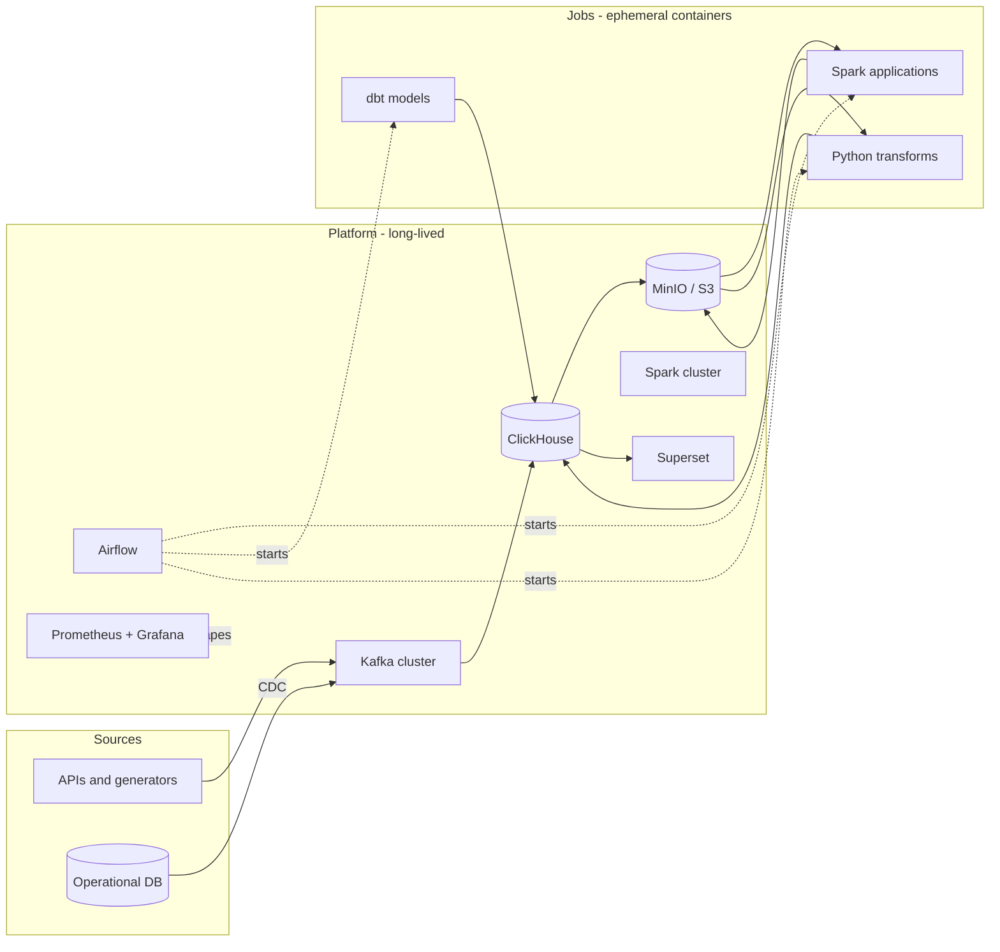

# bigdata-cluster-docker

[](https://github.com/cyril-bulanov-in/bigdata-cluster-docker/actions/workflows/01-kafka.yml)
[](https://github.com/cyril-bulanov-in/bigdata-cluster-docker/actions/workflows/02-monitoring.yml)
[](https://github.com/cyril-bulanov-in/bigdata-cluster-docker/actions/workflows/03-dbms.yml)
[](https://github.com/cyril-bulanov-in/bigdata-cluster-docker/actions/workflows/04-etl.yml)
[](https://github.com/cyril-bulanov-in/bigdata-cluster-docker/actions/workflows/05-minio.yml)
[](https://github.com/cyril-bulanov-in/bigdata-cluster-docker/actions/workflows/06-spark.yml)

A working data platform, assembled with Docker Compose one component at a time.

Most "data engineering portfolio" repositories are a single `docker-compose.yml`
that starts nine services at once and prints a word count. This one is built the
way a platform is actually built: incrementally, with each layer running,
monitored and understood before the next one is added.

Every numbered directory is a self-contained stack with its own compose file,
README and `make up`. They all attach to one shared Docker network, so the
pieces combine into a single platform instead of a pile of unrelated demos.

---

## The idea

Two things shape every decision in this repository.

### Infrastructure and jobs are different things

In a real organisation nobody runs stateful Kafka in Compose and hopes the
volumes survive. Kafka is MSK or Confluent Cloud, storage is S3 plus a
warehouse, orchestration metadata lives in RDS. That side is owned by a platform
team.

What a data engineer actually ships in a container is **code**: a Spark
application, a dbt project, a Python transformation. The container is a unit of
delivery, not a way to host a service. Airflow starts it, it does its work,
it exits.

Steps 4 and 6 make that concrete. The DAGs contain no transformation logic at
all — they name an image, a schedule and some parameters. Nothing in them even
says "Spark": the Spark job is an image like any other, which happens to run
`spark-submit` in its own entrypoint. Moving to EMR Serverless is a change of
operator rather than a rewrite.

### Everything must be portable

Nothing here is allowed to depend on running on a laptop. Object storage speaks
the S3 protocol, so the same `s3a://` path works locally and in AWS with one
environment variable changed. Job code receives every endpoint through the
environment.

| Component | Local (this repo) | Self-hosted cluster | AWS |
|---|---|---|---|
| Broker | Kafka in Compose | Kafka on a Pi cluster | MSK |
| Change capture | Debezium in Kafka Connect | same | MSK Connect or DMS |
| Warehouse | ClickHouse cluster | ClickHouse on the Pi cluster | ClickHouse Cloud |
| Orchestration | Airflow + DockerOperator | same | MWAA + ECS tasks |
| Object storage | MinIO | MinIO on local disks | S3 |
| Processing | Spark standalone | Spark standalone | EMR Serverless |
| Jobs | container images | the same images | the same images |

The job code is identical in all three columns. Only the operator in the DAG
and a handful of environment variables change.

---

## Target architecture



Solid arrows are data. Dotted arrows are control: the orchestrator starts job
containers and the monitoring stack scrapes everything, but neither of them
touches the data itself.

---

## Roadmap

| Step | Stack | What gets built | State |
|---|---|---|---|
| 01 | [Kafka](01-kafka/) | 4-node KRaft cluster, 3-controller quorum, Kafbat UI, JMX metrics | done |
| 02 | [Monitoring](02-monitoring/) | Prometheus with Docker service discovery, Grafana, JMX / lag / host / container exporters, provisioned dashboard | done |
| 03 | [DBMS](03-dbms/) | Postgres, Debezium change capture, ClickHouse cluster of 4 shards x 2 replicas with Keeper, deduplicating staging layer | done |
| 04 | [ETL](04-etl/) | Airflow 3, DAGs that start job containers, a daily mart, a Parquet export to S3 | done |
| 05 | [MinIO](05-minio/) | S3-compatible storage, three-layer bucket layout, versioning, lifecycle rules | done |
| 06 | [Spark](06-spark/) | standalone cluster of 4 workers, S3A with the committer that S3 actually supports, raw to staged | done |
| 07 | dbt | models over everything accumulated: CDC staging and Spark output | next |
| 08 | Superset | dashboards on top of the marts | planned |

Ordered so that each step gets its input from the previous one. Monitoring is
second on purpose: from that point on, every stack arrives with metrics rather
than getting them bolted on. Storage comes before the thing that writes to it,
and dbt comes after Spark so its models are built over the full picture rather
than being rewritten when a second source appears.

Candidates for after step 08, not yet committed: an open table format for the
object storage layer, integration tests with Testcontainers, and a Terraform
deployment of the same architecture to AWS.

---

## What you can practise here

The point is not that the containers start. It is what you can break, measure
and reason about once they do.

**Distributed systems behaviour.** Kill a Kafka broker and watch partition
leadership move and the ISR shrink. Kill a ClickHouse replica and watch writes
keep succeeding on the survivor, then watch the returning node catch up. Stop
the Airflow scheduler and watch the UI carry on looking perfectly healthy while
nothing gets scheduled. Kill a Spark worker mid-job and watch its tasks
reschedule; kill the master and watch running jobs carry on regardless. Each
stack README ends with drills of this kind.

**Failures that leave everything green.** An exporter whose endpoint answers
while exporting nothing usable. A Kafka consumer subscribed to a topic it will
never read. A `CREATE ... ON CLUSTER` that succeeds while every distributed
query fails, because the two use different transports. A distributed JOIN that
returns a plausible, wrong number because the join key is not the sharding key.
A DAG that fails to import and is therefore absent rather than broken. A
versioned bucket quietly keeping every overwrite for ever. A Spark job that
writes `_SUCCESS` into an empty prefix because its committer staged the data
somewhere the driver could not see. An alerting rule naming a metric that does
not exist, which never fires and never complains. These are what the smoke
tests exist for.

**Correctness under change.** Deduplicating a stream of inserts, updates and
deletes so readers see one current row. Why the version column must be a log
position and not a timestamp. Why partitioning by a mutable column silently
breaks deduplication forever. Why overwriting one partition in S3 needs more
care than it looks, and how a re-run of one day can delete a month.

**Operational habits.** Pinned image versions, health checks that mean
something, resource limits, credentials outside version control, one-command
teardown and rebuild from scratch.

---

## Getting started

Each stack runs independently and pulls in what it needs through Compose
`include`. Starting step 6 starts all six.

```bash
cd 06-spark
cp .env.example .env
cp ../05-minio/.env.example ../05-minio/.env
cp ../04-etl/.env.example ../04-etl/.env
cp ../03-dbms/.env.example ../03-dbms/.env
cp ../02-monitoring/.env.example ../02-monitoring/.env
cp ../01-kafka/.env.example ../01-kafka/.env
make up
make test
```

To start only the broker and its monitoring, do the same from `02-monitoring`.
To run without the ClickHouse cluster on a smaller machine, `make up-light`.

Memory is the binding constraint. The full platform with the Spark cluster
wants 64 GiB available to Docker; without Spark, 24 is enough. Each stack
README states its own needs.

---

## Layout

```
bigdata-cluster-docker/
├── README.md              you are here
├── .gitignore             repository-wide
├── .github/workflows/     one CI workflow per stack
└── NN-name/               one directory per stack
    ├── README.md          what it is, how to run it, what to look at
    ├── docker-compose.yml the stack itself, commented line by line
    ├── .env.example       configuration template, copy to .env
    ├── Makefile           up / down / logs / test / stack-specific helpers
    ├── scripts/smoke.sh   assertions about the running stack
    ├── dags/              scheduling only, no logic          (04-etl)
    └── jobs/              the work, as versioned images      (04-etl, 06-spark)
```

---

## Conventions

**One shared network.** The first stack you start creates a bridge network
called `dataplatform`; later stacks join it. Containers reach each other by
service name, never by IP address.

**Nothing runs as `latest`.** Every image tag is pinned in `.env.example`, and
pinned from the **registry** rather than from the project's source releases —
the two are not always in step, and MinIO is the current example: its public
images stop months behind its releases. The same rule applies to jars: their
versions are fixed by what they must match, not chosen, and the Spark image
build opens each one to confirm the class it is supposed to contain.

**Configuration through `.env`.** Secrets and machine-specific values stay out
of the repository. Each stack ships a documented `.env.example`, and `make up`
refuses to start if the real file is missing.

**Exporters register themselves.** Since step 2 Prometheus discovers targets
through the Docker API: an exporter carries `prometheus.scrape`,
`prometheus.port` and optionally `prometheus.job` and `prometheus.path` as
container labels, and no stack has to edit the monitoring configuration to be
seen.

**Jobs are images, not code in the orchestrator.** `dags/` decides when and
with what parameters; `jobs/` does the work. The two never mix, which is what
keeps a job a versioned artifact that runs unchanged anywhere.

**Comments explain the why.** Compose files are written for someone who knows
what a container is but has not memorised Kafka listener semantics or S3A
committer behaviour. Where a setting exists to avoid a specific failure, the
comment says which one — often with the exact error message it produces.

**A `Makefile` per stack.** Standard targets everywhere: `up`, `down`, `clean`,
`ps`, `logs`, `config`, `smoke`, `test`. Run `make` on its own for the full
list.

**Every stack is verified.** `make config` validates the compose file and every
configuration it depends on; `make smoke` asserts properties of the running
stack that a successful start does not prove. GitHub Actions runs both on every
change, on a clean runner, from an empty state.

Where CI cannot cover something, the stack README says so and gives the
commands that do. Steps 3 to 6 are the current examples: eight ClickHouse nodes
do not fit on a GitHub runner, so those workflows start everything else and the
skipped assertions print as `SKIP` rather than quietly disappearing.

---

## Requirements

Docker Engine 24 or newer with Compose v2. Memory is the binding constraint:
Kafka alone wants roughly 8 GB available to Docker, the platform through step 5
wants 24, and adding the Spark cluster brings it to 64. On Docker Desktop this
is under Settings → Resources.

Images are multi-architecture, so the stacks run on both x86-64 and arm64
(Apple Silicon, Raspberry Pi 5).
