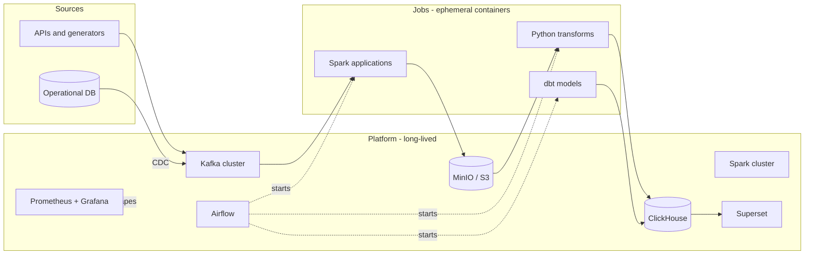

# bigdata-cluster-docker

[](https://github.com/cyril-bulanov-in/bigdata-cluster-docker/actions/workflows/01-kafka.yml)
[](https://github.com/cyril-bulanov-in/bigdata-cluster-docker/actions/workflows/02-monitoring.yml)

A working data platform, assembled with Docker Compose one component at a time.

Most "data engineering portfolio" repositories are a single `docker-compose.yml`
that starts nine services at once and prints a word count. This one is built the
way a platform is actually built: incrementally, with each layer running,
monitored and understood before the next one is added.

Every numbered directory is a self-contained stack with its own compose file,
README and `make up`. They all attach to one shared Docker network, so the
pieces combine into a single platform instead of a pile of unrelated demos.

---

## The idea

Two things shape every decision in this repository.

### Infrastructure and jobs are different things

In a real organisation nobody runs stateful Kafka in Compose and hopes the
volumes survive. Kafka is MSK or Confluent Cloud, storage is S3 plus a
warehouse, orchestration metadata lives in RDS. That side is owned by a platform
team.

What a data engineer actually ships in a container is **code**: a Spark
application, a dbt project, a Python transformation. The container is a unit of
delivery, not a way to host a service. Airflow starts it, it does its work,
it exits.

This repository reproduces that boundary rather than blurring it. The numbered
stacks are the platform: long-lived, stateful, started once and left running.
Job images are versioned artifacts that know nothing about how the platform was
brought up, only the addresses and credentials they were handed. That split is
the point of the whole exercise.

### Everything must be portable

Nothing here is allowed to depend on running on a laptop. Object storage speaks
the S3 protocol, so the same `s3a://` path works locally and in AWS with one
environment variable changed. Job code receives every endpoint through the
environment. Nothing is hardcoded that would have to be rewritten to run
somewhere else.

| Component | Local (this repo) | Self-hosted cluster | AWS |
|---|---|---|---|
| Broker | Kafka in Compose | Kafka on a Pi cluster | MSK |
| Object storage | MinIO | MinIO on local disks | S3 |
| Processing | Spark standalone | Spark standalone | EMR Serverless |
| Orchestration | Airflow + DockerOperator | same | MWAA + ECS tasks |
| Warehouse | ClickHouse | ClickHouse | ClickHouse Cloud |

The job code is identical in all three columns. Only the operator in the DAG
and a handful of environment variables change.

---

## Target architecture



Solid arrows are data. Dotted arrows are control: the orchestrator starts job
containers and the monitoring stack scrapes everything, but neither of them
touches the data itself.

---

## Roadmap

| Step | Stack | What gets built | State |
|---|---|---|---|
| 01 | [Kafka](01-kafka/) | 4-node KRaft cluster, 3-controller quorum, Kafbat UI, JMX metrics | done |
| 02 | [Monitoring](02-monitoring/) | Prometheus, Grafana, JMX / lag / host / container exporters, 12 alerting rules, provisioned dashboard | done |
| 03 | DBMS | PostgreSQL as an operational source, ClickHouse as the warehouse | next |
| 04 | ETL | Airflow, DAGs that launch containers rather than run code in-process | planned |
| 05 | Spark | standalone master and workers, resource limits, a job image | planned |
| 06 | dbt | staging and mart models on ClickHouse, tests, documentation | planned |
| 07 | MinIO | S3-compatible storage, bucket layout, lifecycle, presigned URLs | planned |
| 08 | Superset | dashboards on top of the marts | planned |

Steps are ordered so that each one can be verified on its own. Monitoring comes
second on purpose: from that point on, every stack added later arrives with
metrics rather than getting them bolted on at the end.

Candidates for what comes after step 08, not yet committed: Kafka Connect with
Debezium for change data capture, an open table format for the object storage
layer, integration tests with Testcontainers, and a Terraform deployment of the
same architecture to AWS.

---

## What you can practise here

The point is not that the containers start. It is what you can break, measure
and reason about once they do.

**Distributed systems behaviour.** Kill a broker and watch partition leadership
move and the ISR shrink. Change `min.insync.replicas` and see writes start
failing. Work out why a quorum of four controllers buys nothing over three.
Each stack README ends with a failure drill of this kind.

**The things that actually break in production.** Advertised listeners that work
from inside a network but not outside it. An exporter whose endpoint is green
while it exports nothing usable. Consumer lag under a slow sink. Timestamp and
timezone handling across a Kafka to Parquet to ClickHouse hop. Idempotency of a
pipeline re-run for the same day. Schema changes arriving from upstream without
warning.

**Operational habits.** Pinned image versions, health checks that mean
something, resource limits, credentials outside version control, one-command
teardown and rebuild from scratch.

**Cloud migration mechanics.** Every design note states what the component maps
to in AWS and what would change. Working through that is how the local exercise
turns into something you can discuss with a client.

---

## Getting started

Each stack runs independently, and the later ones pull in what they need.

```bash
cd 01-kafka
cp .env.example .env
make up
make test
```

Step 02 includes step 01, so starting it gives you the cluster and its
monitoring together:

```bash
cd 02-monitoring
cp .env.example .env
make up
make test
```

There is no requirement to run everything at once — start what the task needs.

---

## Layout

```
bigdata-cluster-docker/
├── README.md              you are here
├── .gitignore             repository-wide
├── .github/workflows/     one CI workflow per stack
└── NN-name/               one directory per stack
    ├── README.md          what it is, how to run it, what to look at
    ├── docker-compose.yml the stack itself, commented line by line
    ├── .env.example       configuration template, copy to .env
    ├── Makefile           up / down / logs / test / stack-specific helpers
    └── scripts/smoke.sh   assertions about the running stack
```

---

## Conventions

These hold everywhere, so adding a stack never means learning new rules.

**One shared network.** The first stack you start creates a bridge network
called `dataplatform`; later stacks join it, either by `include` or as an
external network. Containers reach each other by service name, never by IP
address.

**Nothing runs as `latest`.** Every image tag is pinned in `.env.example`. A
floating tag eventually pulls an incompatible version and breaks a stack with no
change on your side. Where a project publishes no maintained image, the
Dockerfile takes the artifact from its GitHub release and verifies it, rather
than trusting a third-party rebuild.

**Configuration through `.env`.** Secrets and machine-specific values stay out
of the repository. Each stack ships a documented `.env.example`, and `make up`
refuses to start if the real file is missing.

**Comments explain the why.** Compose files are written for someone who knows
what a container is but has not memorised Kafka listener semantics or JVM heap
behaviour. Where a setting exists to avoid a specific failure, the comment says
which one.

**A `Makefile` per stack.** Standard targets everywhere: `up`, `down`, `clean`,
`ps`, `logs`, `config`, `smoke`, `test`. Run `make` on its own for the full
list, including helpers specific to that stack.

**Every stack is verified in CI.** `make config` validates the compose file and
every configuration it depends on; `make smoke` asserts properties of the
running stack that a successful start does not prove — node counts, replication,
metrics that are actually populated, a message round trip. GitHub Actions runs
both on every change to that stack, on a clean runner, from an empty state.

---

## Requirements

Docker Engine 24 or newer with Compose v2. Memory is the binding constraint:
the Kafka stack alone wants roughly 8 GB available to Docker, and running it
together with monitoring needs more. On Docker Desktop this is under
Settings → Resources.

Images are multi-architecture, so the stacks run on both x86-64 and arm64
(Apple Silicon, Raspberry Pi 5).
